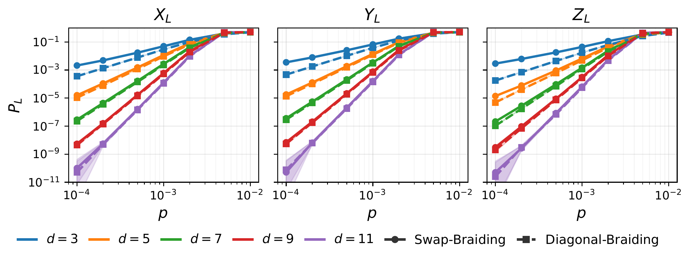
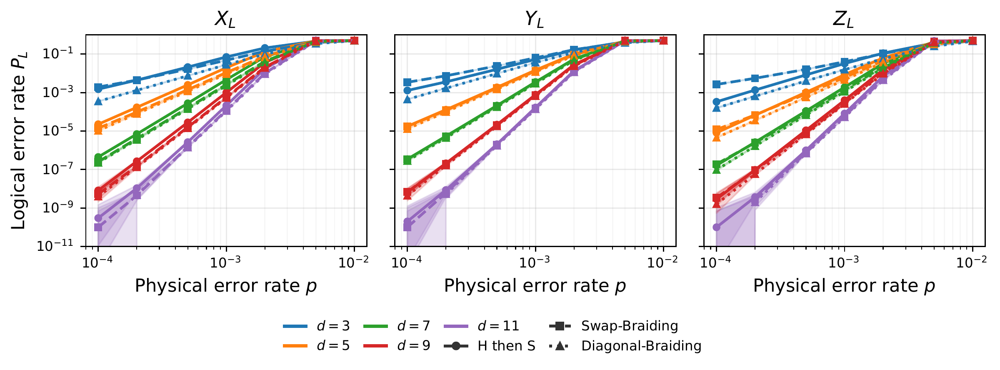

# Logical C Gate in the Surface Code

## Circuit diagrams

Noiseless detector-slice diagrams with operations at code distance **d = 5**:

- [Swap-braiding circuit (bomnbin)](figs/bomnbin_d5_clean_detslice_with_ops.svg)
- [Diagonal-braiding circuit (gidney)](figs/gidney_d5_clean_detslice_with_ops.svg)

## Numerical results

## Additional results
We compared with the conventional H then S gate from Bombín's paper.

